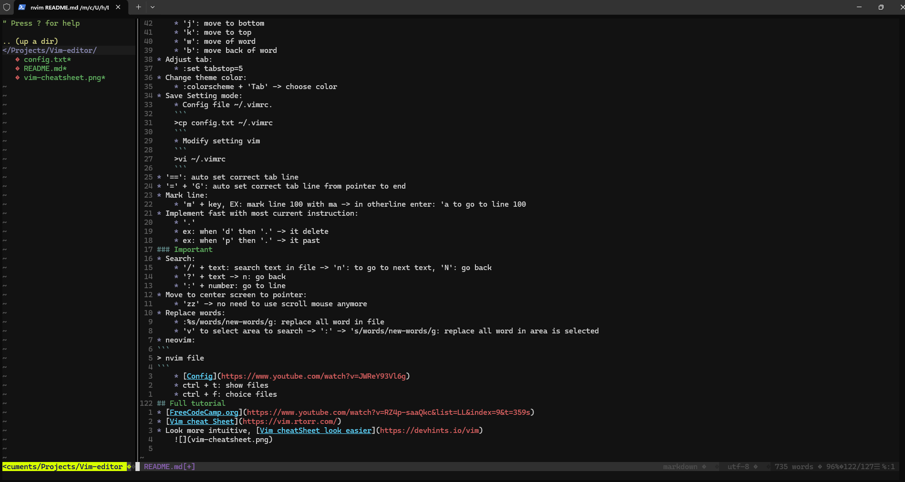
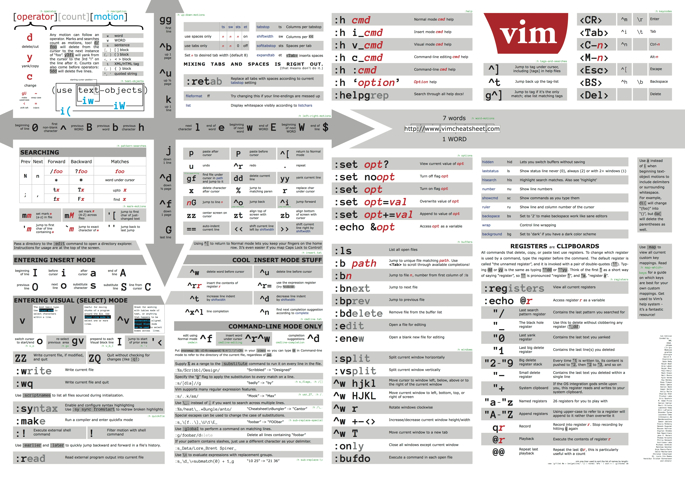

# Vim
## Basic instrucments
* install:
```
>sudo apt install vim
```
* Use vim
```
>vi editfile
or
>vim editfile
```
* Ternimal mode: 'Esc'
* Quit: 
	* ':q': quit
	* ':q!': quit and not save change
	* ':wq': quit and save change
* Insert (edit mode):
	* 'i'
	* 'I': insert in beginning of current line
	* 'a': insert in end of current character
	* 'A': insert in end of current line
	* 'o': insert with newline
	* 's': insert with erase next current character
	* 'ci' + symbol: erase content in symbol and go to insert mode. EX: print("I do not know what to say")
		* ci" => print("")
		* ci( => print()
* Save:
	* ':w'
* Tab:
```
shift select line 
then
>> and <<
```
* Undo:
	* 'u'
	* number + 'u': undo x times
* Redo:
	* Ctrl + 'R'
	* number + Ctrl + 'R': redo x times
* Select multiple words:
	* 'v' + move arrows
	* shift + 'v': select line
	* Use number + arrows to select work faster
	* 'yy': Copy one line
	* 'yiw': Copy one word.
* Delete with key:
	* 'd' + move: delete words and line with direction arrow
	* 'v' -> 'd': delete words are selected by 'v'
	* 'dd': delete one line 
	* d + number + w: delete number of word
	* shift + 'd': delete from current pointer to end line
	* number + 'dd': delete number line
	* 'cc': erase content current line and into edit mode, it different from 'dd', 'cc' erase content of line, but 'dd' erase line
* Past:
	* 'v' -> 'y' -> 'p': copy and past
	* 'v' -> 'd' -> 'p': cut and past
	* Mutiple past: number + 'p'	
	* 'p': past under current line if pointer in begin line
	* shift + 'p': past above current line if pointer in begin line
* Jumping: with code, (), {}
	* '%': jumping to begin and end of block function
	* 'd%': delete block of function
	* 't' + symbol: jump to next symbol.
		* EX: /* asd asf ew */ => 't*' => jump to */
		* switch (c) => 'dt(' => delete everything from begin to ( => (c)
	* shift + 't': jump to before symbol
	* 'gg': jump to begin, shift + 'G': jump to end
	* ':number': jump to number of line
## Advance instrucment
* Number line editor:
	* ':set number'
	* ':set relativenumber': see number line by format 'current line - another line', more convenient for move line with below 'Move faster...'
* Move faster with number line: in terminal mode, typing 'number' and 'move'
	* Example: move from line 1 to line 20 in one 'move key': '20' -> move down
* More convenient way to move pointer:
	* 'h': move to begin
	* 'l': move to end
	* 'j': move to bottom
	* 'k': move to top
	* 'w': move of word
	* 'b': move back of word
* Adjust tab:
	* :set tabstop=5
* Change theme color:
	* :colorscheme + 'Tab' -> choose color
* Save Setting mode:
	* Config file ~/.vimrc.
	```
	>cp config.txt ~/.vimrc
	```
	* Modify setting vim
	```
	>vi ~/.vimrc
	```
* '==': auto set correct tab line
* '=' + 'G': auto set correct tab line from pointer to end
* Mark line:
	* 'm' + key, EX: mark line 100 with ma -> in otherline enter: 'a to go to line 100
* Implement fast with most current instruction:
	* '.'
	* ex: when 'd' then '.' -> it delete
	* ex: when 'p' then '.' -> it past	
### Important
* Search: 
	* '/' + text: search text in file -> 'n': to go to next text, 'N': go back 
	* '?' + text -> n: go back
	* ':' + number: go to line
* Move to center screen to pointer:
	* 'zz' -> no need to use scroll mouse anymore
* Replace words:
	* :%s/words/new-words/g: replace all word in file
	* 'v' to select area to search -> ':' -> 's/words/new-words/g: replace all word in area is selected
* neovim:
```
> nvim file
```
	* [Config](https://www.youtube.com/watch?v=JWReY93Vl6g)
	* ctrl + t: show files
	* ctrl + f: choice files

## Full tutorial
* [FreeCodeCamp.org](https://www.youtube.com/watch?v=RZ4p-saaQkc&list=LL&index=9&t=359s)
* [Vim cheat Sheet](https://vim.rtorr.com/)
* Look more intuitive, [Vim cheatSheet look easier](https://devhints.io/vim)
		

